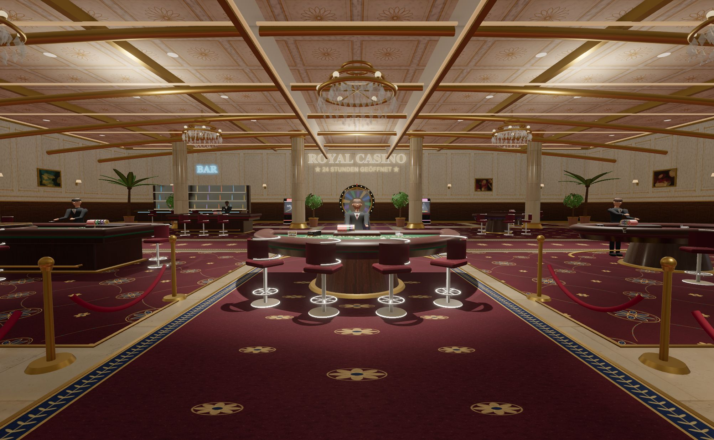

# Grafik- und Performance-Upgrade

Umsetzung der Analyse vom 29.09.2026, ausgehend von Commit `647beae`.

## Sichtbare Änderungen

- Bereinigte GTAO-Eingaben: Labels, unsichtbare Interaktionsflächen, transparente Materialien und Alpha-Test-Blätter erzeugen keine falschen massiven Schattenkörper mehr. Picking bleibt auf einer eigenen Ebene aktiv. AO arbeitet mit halber Auflösung.
- Ruhigeres Licht: zurückgenommene Kristalle und Neonfarben, neutrales Fülllicht, gerichtetes Tischlicht, zwei statt vier schattenwerfende Lichtquellen auf Hoch, eine einzige Vignette. Boden/Wände/Decke erhalten eine gecachte, niedrig aufgelöste Approximation statischen indirekten Lichts. Das ist ausdrücklich keine raytracierte GI-Lösung.
- Neue stilisierte Skelettfiguren: durchgehende Ärmel und Hosenbeine mit gewichteten Gelenken, Kleidung, Hände, kleinere Augen, Geh-/Sitz-/Standposen und Kartengeben mit bewegter Karte. Zwei Körpermaterialien, gemeinsame Geometrien/Texturen, vereinfachte Fernstufe. Individuelle Materialinstanzen bleiben für die Spielertransparenz nötig.
- Lokale CC0-Materialkarten für Marmor, Holz, Leder und Gewebe; abgestimmte Farb-, Normal- und Rauheitskarten. Downloadquellen und Prüfsummen stehen unter `public/assets/materials`. Filz und Raumdekore behalten passende prozedurale Farbgestaltung. Teppichmikrostruktur hat einen konsistenten Metermaßstab.
- Kleine kontextabhängige Stationslabels statt eines großen schwebenden Schriftbands; bestehende physische Tischschilder und Automatenbeschriftungen bleiben erhalten. Gold, dunkles Holz und Bordeaux bilden die Grundpalette.
- Räumliche Batches und Instanzen, statische Automatengehäuse getrennt von bewegten Teilen; Fernstufen für Walzen und Figuren, vereinfachte Gehäusegeometrie auf Niedrig. Entfernte Dekoration animiert mit 12/24 Hz und akkumuliert dabei die Simulationszeit.
- Reflexionen aktualisieren sich bei Kamerabewegung häufiger und bei ruhender Kamera maximal zehnmal pro Sekunde. Schatten haben eine Zeitgrenze von 24 Hz. Pixelbudgets und adaptive Auflösung mit Hysterese begrenzen die Kosten hochauflösender Displays.
- Cache-Abfragen erfolgen vor dem Materialaufbau. Hauptmaterialkarten sind vorgefertigte lokale Dateien; die verbleibenden Dekor-Canvas werden einmal je Cacheeintrag erzeugt.
- Vollständiges Aufräumen eigener Materialien, Texturen, Skelette und RenderTargets; gemeinsame Assets bleiben erhalten. Dispose entfernt Texturen aus der Registry, globale Eingaben werden per AbortController abgemeldet. Eingebettete Spiele besitzen eigene, abbrechbare Tween-Gruppen.
- Hochformat erhält eine breitere Tischperspektive. Das Roulette-Setzfeld und die schmale obere Navigation sind horizontal scrollbar statt seitlich abgeschnitten.

## Prüfung

- `npm test`: neun gezielte Regressionstests für Cache, Ressourcenbesitz, AO-Sichtbarkeit/Auflösung, Instancing/Welttransformationen, räumliche Batches/Ebenen, adaptive Auflösung, Animationszeit, Fehler-Cleanup der Reflexion und Picking.
- Bestehende API-Rauchtests: `scripts/smoke.js`, `smoke-derby.js`, `smoke-keno.js`, `smoke-poker3.js`, `smoke-scratch.js`, `smoke-war.js` bestanden. Testdatenbanken liegen isoliert im temporären Verzeichnis.
- Browser: alle 17 Spiele in Hoch → Mittel → Niedrig → Hoch aufgebaut und entsorgt (68 Montagen), Spielbereitschaft, ausgeblendete Dekoration, Wiederherstellung, Tween-Cleanup und Canvas-Anzahl geprüft. Keine Browserfehler/Warnungen. Registry nach jedem Durchlauf: 213 Texturen; eine Renderfläche und ein Hallen-Updater.
- AO-Normalenbild visuell geprüft: keine schwarzen Sprite-Flächen oder massiven unsichtbaren Klickboxen.
- Desktop, Nahansicht des Dealers, reale Roulette-Ansicht sowie Hochformat 390 × 844 geprüft. Rechter Rand des mobilen Setzfeldes ist durch Scrollen erreichbar.
- DPR-2-Simulation bei 1280 × 800: durch Qualitätsgrenze auf 2240 × 1400 Renderpixel (DPR 1,75) begrenzt; Median 17,0 ms. Keine Browserwarnungen. Adaptive Auflösung bleibt bei diesem Lauf stabil.
- Niedrig bei 390 × 844 und simulierter DPR-2-Anforderung: Renderbuffer bleibt bei 390 × 844, 450 Zeichenaufrufe pro Frame, keine Echtzeitschatten. Die Aufnahme stammt weiterhin vom Desktop-Testbrowser.
- Physische Mobilgeräte und langfristige Multiplayer-Last wurden nicht gemessen. Figuren sind bewusst stilisiert; die neuen Materialien ersetzen keinen vollständigen externen Figuren-/Architektur-Asset-Satz.

## Reproduzieren

`npm run test:graphics` startet eine lokale Testinstanz mit einer eigenen temporären Datenbank und ohne Bots. Die Diagnose-Endpunkte sind im normalen Serverbetrieb nicht vorhanden.

- `http://localhost:3100/__review.html?quality=high&cacheprobe=1`: feste Eingangsperspektive, Messung nach sieben Sekunden Aufwärmzeit, adaptive Auflösung für den Vergleich aus.
- `?quality=medium` / `?quality=low`: Qualitätsvergleich.
- `?quality=high&normals=1`: AO-Geometriebild.
- `?quality=high&actor=1`: Figurennahansicht.
- `?quality=high&retina=1`: simulierte DPR-2-Anforderung an die Renderpipeline; kein physisches Retina-Gerät.
- `?quality=high&adaptive=1`: adaptive Auflösung eingeschaltet.
- `http://localhost:3100/__qa.html`: Button für den vollständigen Spiel-/Qualitätswechseltest. Erstellt ein synthetisches Konto nur in der Testdatenbank, setzt keine Spieleinsätze.

Screenshots und Rohdaten liegen in `docs/graphics-evidence`. RAF-Abstände sind lokale Browsermessungen, keine isolierten GPU-Zeiten und keine zugesicherte Bildrate auf Endgeräten. Der Aufbau-Timer beginnt nach dem Materialdownload; kalte Shader-Kompilierung kann den ersten Aufbau zusätzlich verzögern.

## Vergleichsmessung

Feste Eingangsperspektive, 2004 × 1236, DPR 1, Hoch, keine Mitspieler, mehrere hundert Frames nach Aufwärmen. Alle Renderpässe sind in den Zeichenaufrufen enthalten; adaptive Auflösung ist für diesen Vergleich deaktiviert.

| Messgröße | Ausgangszustand | Nachher |
|---|---:|---:|
| Zeichenaufrufe pro vollständigem Frame | 2.956 | 1.430 |
| Dreiecke über alle Pässe | ca. 1,36 Mio. | ca. 0,675 Mio. |
| Median Frameabstand | 23,8 ms | 14,6 ms |
| Erfasste RAF-Rate | 41,8/s | 66,1/s |
| Schattenwerfende Lichter | 4 | 2 |
| Wiederholter Marmor-Cacheabruf | 249–258 ms | < 1 ms |

Rund 52 % weniger Zeichenaufrufe und 39 % kürzerer medianer Frameabstand in dieser Testszene. Das erste Laden der neuen Texturen und kalte Shader-Kompilierung sind nicht im Framevergleich enthalten. Daten und Bildstand wurden nach den Änderungen erneut erfasst.

